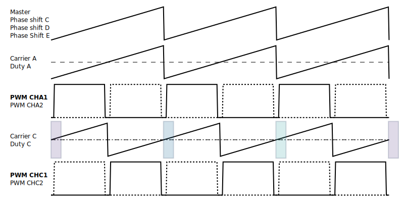
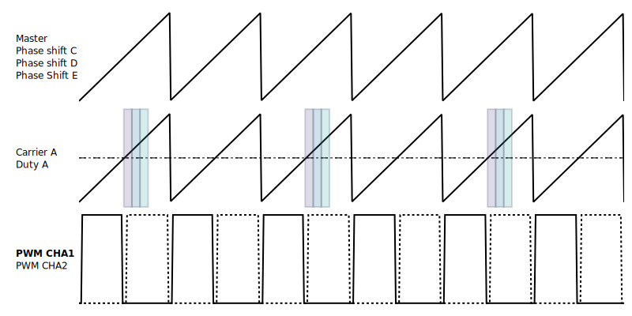
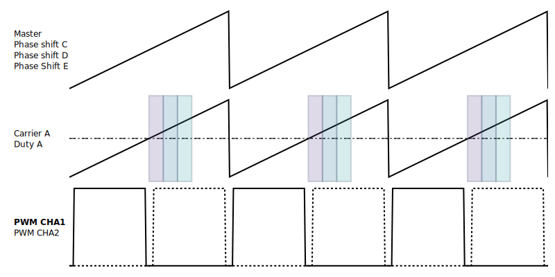

## Initialization sequence

!!! Note

    === "Software triggered"
        1. Link an adc trigger event to the ADC [`spin.adc.configureTriggerSource(ADCx, TRIG)`](https://owntech-foundation.github.io/Documentation/powerAPI/classAdcHAL/#function-configuretriggersource)
        2.  Define acquisition sequence by enabling adc channel : [`spin.adc.enableChannel(ADCx, channelx)`](https://owntech-foundation.github.io/Documentation/powerAPI/classAdcHAL/#function-enablechannel)
        3.  trigger an adc [`data.triggerAcquisition()`](https://owntech-foundation.github.io/Documentation/core/docs/dataAPI/#function-triggeracquisition)
        4.  Retrieve value : [`data.getLatest(ADCx, pinx)`](https://owntech-foundation.github.io/Documentation/core/docs/dataAPI/#function-getlatest-22)

    === "Hardware triggered"
        1\. [Make sure PWM engine is initialized](pwm/#initialization-sequence)
        2. Link an adc trigger event to the ADC [`spin.adc.configureTriggerSource(ADCx, TRIG)`](https://owntech-foundation.github.io/Documentation/powerAPI/classAdcHAL/#function-configuretriggersource)
        3. Set continuous/discontinuous conversion mode. Optional : [`spin.adc.configureDiscontinuousMode(x, 0/1)`](https://owntech-foundation.github.io/Documentation/powerAPI/classAdcHAL/#function-configurediscontinuousmode)
        4.  Define acquisition sequence by enabling adc channel : [`spin.adc.enableChannel(ADCx, channelx)`](https://owntech-foundation.github.io/Documentation/powerAPI/classAdcHAL/#function-enablechannel)
        6. Start data dispatching to get acquired values [`data.start()`](https://owntech-foundation.github.io/Documentation/core/docs/dataAPI/#function-start)
        7.  Retrieve value : [`data.getLatest(ADCx, pinx)`](https://owntech-foundation.github.io/Documentation/core/docs/dataAPI/#function-getlatest-22)

!!! example

    === "Software triggered"
        ```cpp
        spin.adc.configureTriggerSource(1, software);
        spin.adc.enableChannel(1, 30);
        data.triggerAcquisition(1);
        float32_t adc_value = 	data.getLatest(1, 30);
        ```
    === "Hardware triggered"
        ```cpp
        /* PWM unit initialization */
        spin.pwm.setModulation(PWMA, UpDwn);
        spin.pwm.setAdcEdgeTrigger(PWMA, EdgeTrigger_up);
        spin.pwm.setAdcDecimation(PWMA, 1);
        spin.pwm.setMode(PWMA, VOLTAGE_MODE);
        spin.pwm.initUnit(PWMA);
        spin.pwm.setDeadTime(PWMA, 200,200);
        spin.pwm.setAdcTrigger(PWMA, ADCTRIG_1);
        spin.pwm.enableAdcTrigger(PWMA);
        spin.pwm.setDutyCycle(0.5);
        spin.pwm.startDualOutput(PWMA);

        /* ADC initialization */
        spin.adc.configureTriggerSource(1, hrtim_eev1);
        spin.adc.configureDiscontinuousMode(1,1);
        spin.adc.enableChannel(1, 30);
        data.start();
        float32_t adc_value = 	data.getLatest(1, 30);
        ```


## Software triggered

=== " "
    { width=300 align=left }

    A software trigger for an ADC is a command or signal generated by the software to start the ADC conversion process. Instead of using a hardware signal or event to initiate the conversion, the ADC is triggered by software instructions, allowing for precise control and synchronization with other software processes or events. For example this trigger command can be generated from a high speed control task.

    ```C++
    spin.adc.configureTriggerSource(2, software); // ADC 2 configured in software mode
    data.triggerAcquisition(2); // Send an adc trigger to ADC2 to start conversion
    adc_value = data.getLatest(2, 35); // Get the acquired data
    ```

    !!! example
        See the following example for an application :

        - [Software trigerred ADC](https://owntech-foundation.github.io/Documentation/examples/SPIN/ADC/adc_software_trigger/)

## Synchronous with PWMs

Software triggers is generally speaking not suitable for applications that requires precise timing.
Sometimes measurement have to be taken at a specific time, in interaction with the control signal.

!!! info
    This kind of acquisition have a side benefit. It operates in the background and does not interfer with software.
    It means that periodical sampling will not interrupt code execution.

The trigger is the PWM peripheral, the ADC performs the conversion and place the result in an output buffer, the output buffer is directly placed in memory by a DMA. A rather complex software mechanics execute periodically and serve each measurement in a dedicated memory space. The periodical routine is executed at the beggining of the controlTask.

!!! info
    Synchronous measurement require having a controlTask running.

!!! tip
    This page informs on how to parameters the triggering of the measurement
    To retrieve measurement values please refer to DataAPI

The section below explain how to synchronize measurements with control signals.

!!! note
    These features are available for ADC1 and ADC2.


### Source ADC and PWM channel

ADC1 and ADC2 can be associated with PWM channels at will.

::: doxy.powerAPI.class.method
name: AdcHAL
method: void configureDiscontinuousMode (uint8_t adc_number, uint32_t dicontinuous_count)

=== "ADC1 and PWMA"
    { width=800 }

    ```c++
        spin.pwm.setAdcTrigger(PWMA, ADCTRIG_1);
        spin.pwm.enableAdcTrigger(PWMA);
    ```

=== "ADC1 and PWMC"
    { width=800 }

    ```c++
        spin.pwm.setAdcTrigger(PWMC, ADCTRIG_1);
        spin.pwm.enableAdcTrigger(PWMC);
    ```

### Modulation impact

!!! note
    Hardware trigger depends on PWM modulation.

=== "Left Aligned Modulation"
    { width=800 }

    ```c++
        spin.pwm.setAdcTrigger(PWMA, ADCTRIG_1);
        spin.pwm.enableAdcTrigger(PWMA);
    ```

=== "Center aligned modulation"
    { width=800 }

    ```c++
        spin.pwm.setAdcTrigger(PWMA, ADCTRIG_1);
        spin.pwm.enableAdcTrigger(PWMA);
    ```

### Rising Edge / Falling edge

!!! note
    This only applies to center aligned modulation.

=== "Rising Edge"
    { width=800 }

    ```c++
        spin.pwm.setAdcEdgeTrigger(PWMA, EdgeTrigger_up);
        spin.pwm.setAdcTrigger(PWMA, ADCTRIG_1);
        spin.pwm.enableAdcTrigger(PWMA);
    ```

=== "Falling Edge"
    { width=800 }


    ```c++
        spin.pwm.setAdcEdgeTrigger(PWMA, EdgeTrigger_down);
        spin.pwm.setAdcTrigger(PWMA, ADCTRIG_1);
        spin.pwm.enableAdcTrigger(PWMA);
    ```


### Measurment trigger instant

Trigger timing can be defined or changed dynamically.

=== "20% Duty cycle"
    { width=800 }

    ```c++
        spin.pwm.setAdcTriggerInstant(PWMA, 0.2);

    ```

=== "80% Duty cycle"
    { width=800 }

    ```c++
        spin.pwm.setAdcTriggerInstant(PWMA, 0.8);
    ```

### Number of PWM period between acquisition

!!! note
    This is relevant if more than one measurement is taken with the same ADC.

=== "With 2 periods"
    { width=800 }

    ```c++
        spin.pwm.setAdcTriggerPostScaler(PWMA, 2);
    ```

=== "With 4 periods"
    { width=800 }

    ```c++
        spin.pwm.setAdcTriggerPostScaler(PWMA, 4);
    ```

=== "Without interuptions"
    { width=800 }

    ```c++
        spin.pwm.setAdcTriggerPostScaler(PWMA, 1);
    ```
!!! example
    see the following example for an application :

    - [PWM trigerred ADC](https://owntech-foundation.github.io/Documentation/examples/SPIN/ADC/adc_hrtim_trigger/)
