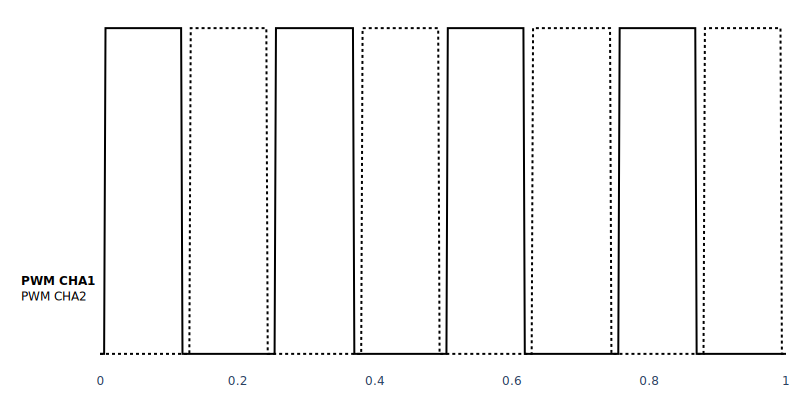
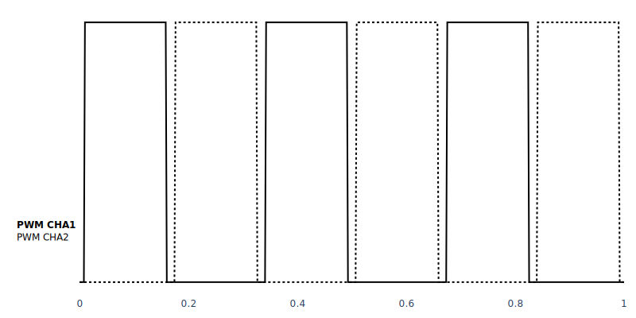
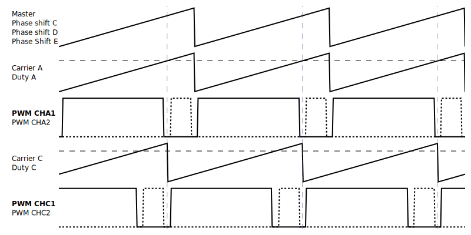

!!! note ""
    PWM, or Pulse Width Modulation, is a method used in electronics to control the power supplied to devices like motors, LEDs, and heaters. Instead of changing the voltage or current level, PWM changes the amount of time the power is on (the pulse width) compared to the time it's off.

    In power electronics, PWM is super important because it allows us to control the average power delivered to a load by varying the duty cycle of the pulse. This means we can regulate the speed of motors or the brightness of LEDs.

## Features

=== " "

    { align=left }

    - Up to 5 pairs of PWMs possible (PWMA, PWC, PWMD, PWME, PWMF)
    - Each PWM unit has a miminum resolution of 184ps.
    !!! note
        The resolution of a PWM signal defines the maximum number of steps that can be present in a single PWM period. In other words, it determines how finely you can adjust the pulse width of the signal. A higher resolution means you can make smaller and more precise adjustments to the pulse width.

    - Frequencies in the range of 650Hz to 1Ghz theorically possible. Tests were made from 2kHz up to 10MHz.
    !!! warning
        Only 200Khz was tested with TWIST
    - Two different modulation mode possible : left aligned, and center aligned
    - Two ADC linkable to two differents PWM unit for precise measurement instant
    - Compatible for peak current control with the internal analog comparator
    - Positive and negative dead time set via software
    - Phase shift possible for interleaved operations

## Include

!!! note 
    ```
    #include <SpinAPI.h>
    ```
    Make sure that SPIN API is included to use PwmHAL 

## Initialization sequence


!!! Note Pre-initialization
    Function to call before initializing the PWM unit.

    === "Software triggered"
        1\.  Set the modulation type : [`spin.pwm.setModulation(PWMx, lft_aligned/upDwn)`](https://owntech-foundation.github.io/Documentation/powerAPI/classPwmHAL/#function-setmodulation)  
        2. Set wich output (1 or 2) will be controlled by the duty cycle, the other will be complementary [`spin.pwm.setSwitchConvention(PWMx, PWMx1/PWMx2)`](https://owntech-foundation.github.io/Documentation/powerAPI/classPwmHAL/#function-setswitchconvention)  
        3.  Set if the pwm is designed to be duty-cycle driven (voltage mode) or current driven (current mode) [`spin.pwm.setMode(PWMx, voltageMode/currentMode)`](https://owntech-foundation.github.io/Documentation/powerAPI/classPwmHAL/#function-setmode)  
        4.  Initialize the pwm unit : [`spin.pwm.initUnit(PWMx)`](https://owntech-foundation.github.io/Documentation/powerAPI/classPwmHAL/#function-initunit)  

    === "Hardware triggered"
        1\.  Set the modulation type : [`spin.pwm.setModulation(PWMx, lft_aligned/upDwn)`](https://owntech-foundation.github.io/Documentation/powerAPI/classPwmHAL/#function-setmodulation)  
        2. Set ow which edge (up/down) to trigger adc conversion [`spin.pwm.setAdcEdgeTrigger(PWMx, edgeTrigUp/edgeTrigDwn)`](https://owntech-foundation.github.io/Documentation/powerAPI/classPwmHAL/#function-setadcedgetrigger)  
        3. Set the division of the number of trigger in a fixed period [`spin.pwm.setAdcDecimation(PWMx, DecimValue)`](https://owntech-foundation.github.io/Documentation/powerAPI/classPwmHAL/#function-setadcdecimation)  
        4. Set wich output (1 or 2) will be constrolled by the duty cycle, the other will be complementary [`spin.pwm.setSwitchConvention(PWMx, PWMx1/PWMx2)`](https://owntech-foundation.github.io/Documentation/powerAPI/classPwmHAL/#function-setswitchconvention)  
        5.  Set if the pwm is designed to be duty-cycle driven (voltage mode) or current driven (current mode) [`spin.pwm.setMode(PWMx, voltageMode/currentMode)`](https://owntech-foundation.github.io/Documentation/powerAPI/classPwmHAL/#function-setmode)  
        6.  Initialize the pwm unit : [`spin.pwm.initUnit(PWMx)`](https://owntech-foundation.github.io/Documentation/powerAPI/classPwmHAL/#function-initunit)  

!!! Note Post-initialization
    Function to call after initializing PWM unit.

    === "Software triggered"
        1.  Set the rising/falling dead time. Can be changed before/after init : [`spin.pwm.setDeadTime(PWMx, rise, fall)`](https://owntech-foundation.github.io/Documentation/powerAPI/classPwmHAL/#function-setdeadtime)  
        2. Set an initial value for the  duty cycle [`spin.pwm.setDutyCycle(0.5)`](https://owntech-foundation.github.io/Documentation/powerAPI/classPwmHAL/#function-setdutycycle)  
        3. Start the PWM, either start both outout or just one [`spin.pwm.startDualOutput(PWMx)`](https://owntech-foundation.github.io/Documentation/powerAPI/classPwmHAL/#function-startdualoutput) / [`spin.pwm.startSingleOutput(PWMx, PWMx1/PWMx2)`](https://owntech-foundation.github.io/Documentation/powerAPI/classPwmHAL/#function-startsingleoutput)      
        4. if ADC hardware triggered : [follow ADC init sequence](adc/#initialization-sequence)  

    === "Hardware triggered" 
        1.  Set the rising/falling dead time. Can be changed before/after init : [`spin.pwm.setDeadTime(PWMx, rise, fall)`](https://owntech-foundation.github.io/Documentation/powerAPI/classPwmHAL/#function-setdeadtime)  
        2. Set wich ADC trigger to link to PWM unit [`spin.pwm.setAdcTrigger(PWMx, ADCtrig)`](https://owntech-foundation.github.io/Documentation/powerAPI/classPwmHAL/#function-setadcedgetrigger)  
        3.  Enable the adc trigger [`spin.pwm.enableAdcTrigger`](https://owntech-foundation.github.io/Documentation/powerAPI/classPwmHAL/#function-enableadctrigger)  
        4. Set an initial value for the  duty cycle [`spin.pwm.setDutyCycle(0.5)`](https://owntech-foundation.github.io/Documentation/powerAPI/classPwmHAL/#function-setdutycycle)  
        5. Start the PWM, either start both outout or just one [`spin.pwm.startDualOutput(PWMx)`](https://owntech-foundation.github.io/Documentation/powerAPI/classPwmHAL/#function-startdualoutput) / [`spin.pwm.startSingleOutput(PWMx, PWMx1/PWMx2)`](https://owntech-foundation.github.io/Documentation/powerAPI/classPwmHAL/#function-startsingleoutput)      
        6. if ADC hardware triggered : [follow ADC init sequence](adc/#initialization-sequence)  

!!! example 
    
    === "Software triggered"
        ```cpp 
        spin.pwm.initFixedFrequency(frequency); 
        spin.pwm.setModulation(PWMA, UpDwn);
        spin.pwm.setSwitchConvention(PWMA, PWMx1);
        spin.pwm.setMode(PWMA, VOLTAGE_MODE);
        spin.pwm.initUnit(PWMA);
        spin.pwm.setDeadTime(PWMA, 200,200);
        spin.pwm.setDutyCycle(0.5);
        spin.pwm.startDualOutput(PWMA);
        ```
    === "Hardware triggered"
        ```cpp
        spin.pwm.initFixedFrequency(frequency); 
        spin.pwm.setModulation(PWMA, UpDwn);
        spin.pwm.setAdcEdgeTrigger(PWMA, EdgeTrigger_up);
        spin.pwm.setSwitchConvention(PWMA, PWMx1);
        spin.pwm.setAdcDecimation(PWMA, 1);
        spin.pwm.setMode(PWMA, VOLTAGE_MODE);
        spin.pwm.initUnit(PWMA);
        spin.pwm.setDeadTime(PWMA, 200,200);
        spin.pwm.setAdcTrigger(PWMA, ADCTRIG_1);
        spin.pwm.enableAdcTrigger(PWMA);
        spin.pwm.setDutyCycle(0.5);
        spin.pwm.startDualOutput(PWMA);
        ```

## How it works

To generate a PWM you need two signals, a variable high frequency signals called the carrier and a constant signal called the duty cycle. 

### Carrier signal and PWM resolution

The carrier signal is usually a counter in the form of a sawtooth or triangle wave. The frequency of the PWM is given by the max value of that counter. It means that the minimal duty cycle step of phase step, is proportional to the frequency of the signal.

!!! example
    Here is a counter incrementing from 0 to 27200.
    

    The increment between each step is made at the PWM resolution which is here 184ps, so the carrier gets from 0 to 27200 in 5µs so a frequency of 200kHz.  
    In other words the smallest step is 1/27200 or 0.0037% of the period. 

### Duty cycle

The duty cycle is a constant value compared to the carrier. 


When the carrier is superior to the duty cycle, the logic output is at high level. On the contrary, when the carrier is inferior to the duty cycle the the output logic is low level. A PWM signal is thus a sqarewave signal with a frequency (the **switching frequency**) being fixed by the carrier.

Varying the duty cycle is how to vary the output of the PWM.


## Snippet examples


### Frequency

=== "200kHz frequency"
    { width=800 }

    ```c++
        spin.pwm.setFixedFrequency(200000);

    ```


=== "400kHz frequency"
    { width=800 }

    ```c++
        spin.pwm.setFixedFrequency(400000);

    ```

### Single/Dual Output

=== "Single Output"
    { width=800 }

    ```c++
        spin.pwm.startSingleOutput(PWMA, TIMING_OUTPUT1);    
    ```

=== "Single Output PWMx2"
    { width=800 }

    ```c++
        spin.pwm.startSingleOutput(PWMA, TIMING_OUTPUT2);    
    ```

=== "Dual Output"
    { width=800 }

    ```c++
        spin.pwm.startDualOutput(PWMA);
    ```

### Duty Cycle

=== "20% Duty cycle"
    { width=800 }

    ```c++
        spin.pwm.setDutyCycle(PWMA, 0.2);

    ```


=== "80% Duty cycle"
    { width=800 }

    ```c++
        spin.pwm.setDutyCycle(PWMA, 0.8);
    ```

=== "How it works"
    { width=800 }

    ```c++
        spin.pwm.setDutyCycle(PWMA, 0.8);
    ```

### Phase Shift

!!! tip 
    PWMA is defined as the phase reference. It can not be phase shifted. 
    If you are not using PWMA, you can define any PWM channel as the reference by setting its phase shift to 0°  
    NB: Phase reference is 0°.

=== "20% Phase Shift"
    { width=800 }

    ```c++
        spin.pwm.setPhaseShift(PWMC,  72);
    ```

=== "80% Phase Shift"
    { width=800 }

    ```c++
        spin.pwm.setPhaseShift(PWMC,  288);
    ```

=== "How it works"
    { width=800 }

    ```c++
        spin.pwm.setPhaseShift(PWMA,  288);
    ```

### Dead Time

=== "2% Dead Time"
    { width=800 }

    ```c++
        spin.pwm.setDeadtime(PWMA,  100,  100);

    ```

=== "8% Dead Time"
    { width=800 }

    ```c++
        spin.pwm.setDeadtime(PWMA,  400,  400);
    ```

=== "Asymetric Dead Time leading edge"
    { width=800 }

    ```c++
        spin.pwm.setDeadtime(PWMA,  100,  400);
    ```

=== "Asymetric Dead Time trailing edge"
    { width=800 }

    ```c++
        spin.pwm.setDeadtime(PWMA,  400,  100);
    ```

### Modulation Type

=== "Left Aligned"
    { width=800 }

    ```c++
        spin.pwm.setModulation(PWMA, Lft_aligned);
        spin.pwm.setDutyCycle(PWMA, 0.28);
    ```

=== "Center Aligned"
    { width=800 }

    ```c++
        spin.pwm.setModulation(PWMA, UpDwn);
        spin.pwm.setDutyCycle(PWMA, 0.28);
    ```

!!! Example 
    See this examples for more details :  

    - [How to control duty cycle of a PWM unit](https://owntech-foundation.github.io/Documentation/examples/SPIN/PWM/duty_cycle_setting/)  

    - [How to set the trigger instant by linking adc trigger to PWM unit](https://owntech-foundation.github.io/Documentation/examples/SPIN/ADC/adc_hrtim_trigger/)  

    - [Managing phase shift between two PWM units](https://owntech-foundation.github.io/Documentation/examples/SPIN/PWM/phase_shift/)

::: doxy.powerAPI.class
name: PwmHAL
